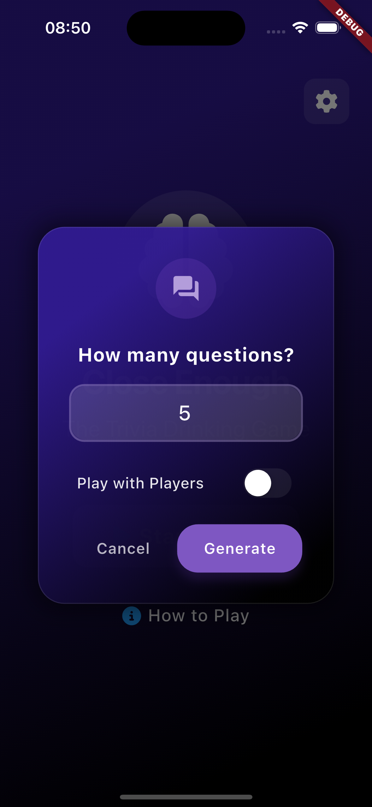
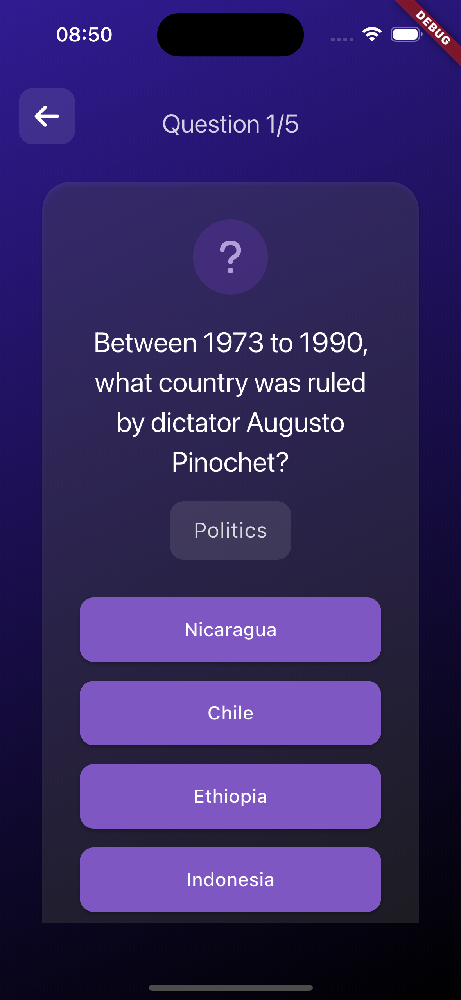

# Close Enough Trivia

A modern Flutter trivia game that lets you play solo or compete with friends. Built with Flutter and powered by the Open Trivia DB API.

## Features

- Single & Multiplayer modes
- Dynamic questions from Open Trivia DB
- Score tracking
- Modern UI with smooth animations

## Tech Stack

- Flutter & Dart
- Auto Route for navigation
- Provider for state management
- Open Trivia DB API integration

## Getting Started

```bash
# Clone the repository
git clone https://github.com/yourusername/close-enough-trivia.git

# Install dependencies
flutter pub get

# Run the app
flutter run
```

## How to Play

1. Choose single or multiplayer mode
2. Select number of questions
3. Answer questions and track your score
4. Compare results with friends in multiplayer mode

## Screenshots





## License

MIT License
